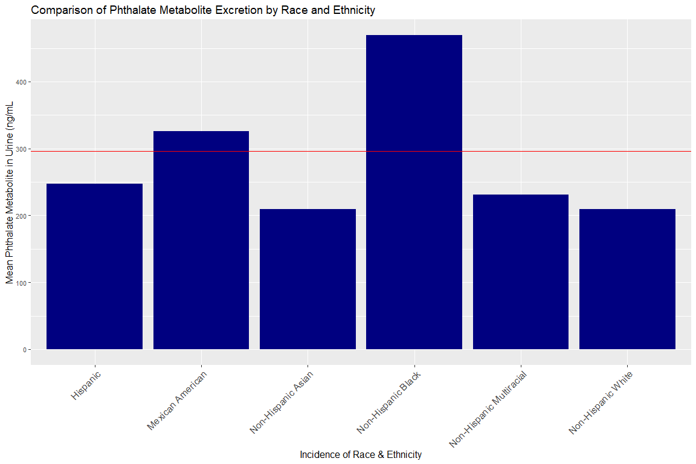

Exploring Phthalate Exposure among Adults in 2015-2016
================

Summary
-------

According to the CDC, certain demographic groups have a higher rate of cancer and other health disparities than other groups. Even in the state of California, extensive efforts have been made to clearly assess carcinogenic chemicals and their impact on communities . Nevertheless, many consumer products are not regulated by the Food and Drug Administration and one must wonder if the lack of regulation and extensive use of products are linked to long term indirect health problems. This phenomenon is characterized by Dr. Leonardo Trasande's book, *Sicker, Fatter, Poorer: The Urgent Threat of Hormone-Disrupting Chemicals to Our Health and Future . . . and What We Can Do About It*, where he goes on to describe the possible connection of environmental chemicals to health disparities and the cost of health care to treat the conditions. Moreover, it's been said that these chemicals may strongly effect certain demographic groups more than others. This exploration will seek to investigate the potential relationship between phthalates (chemicals found in health and beauty aid consumer products) and possible health disparities amongst varying demographic populations in the United States. Ultimately, if there is a relationship this may elicit questions concerning “ecojustice”.

Motivation
----------

I recently viewed a podcast of sorts where a prominent member of my community briefly mentioned a comparison between consumer spending and health disparities for certain groups. She stated that certain groups have a higher rate of health issues and disease, yet are one of the leading consumers of health and beauty aid products. The premise is based on the concern that the health and beauty aid consumer product industry is not regulated by formal organizations such as the FDA. As a result, the question of whether certain chemicals found in health and beauty aid products are linked to health disparities like diabetes, cancer, thyroid issues, and reproductive issues.

Questions to Ponder
-------------------

Question: Are there observable differences for phthalate intake amontst varying populations? Hypothesis: There are differences for phthalate intake amongst varying populations.

Data Sources
------------

Data was retrieved from the Center of Disease Controls' National Health and Nutrition Examination Survey. While this program has been in existence since the early 1960s, the survey became a continuous program in 1999.

Furthermore, the NHANES program is a long term or longitudinal study in which health and nutritional information for 5000 adults and children have been examined each year.

The survey is unique in which it combines interviews, physical exams, and laboratory results. See <https://www.cdc.gov/nchs/nhanes/index.htm> for more details.

Examples of Exporation
----------------------

#### *Explore the app at <https://newood.shinyapps.io/Demographic-Phthalate-Intake-/> for more information*
